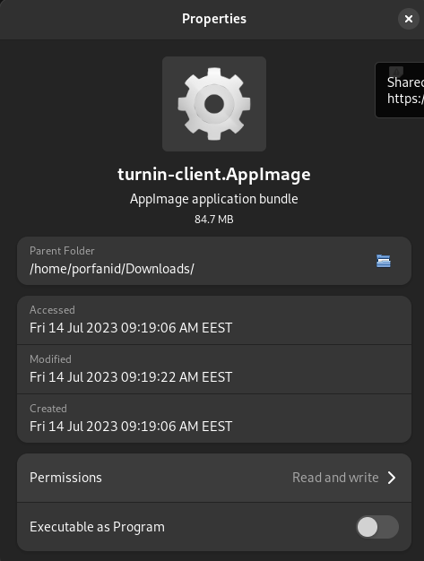
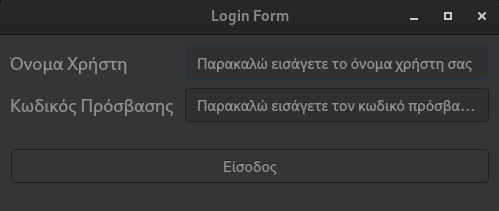
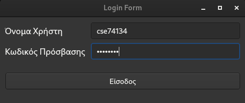
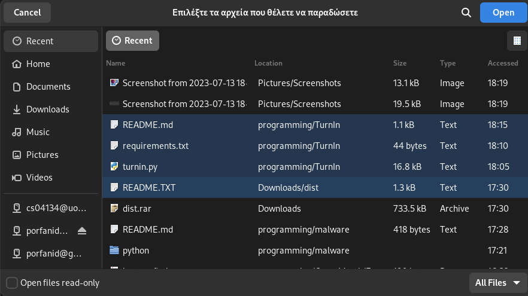
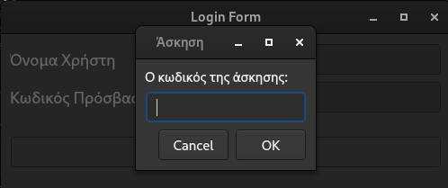
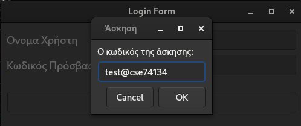
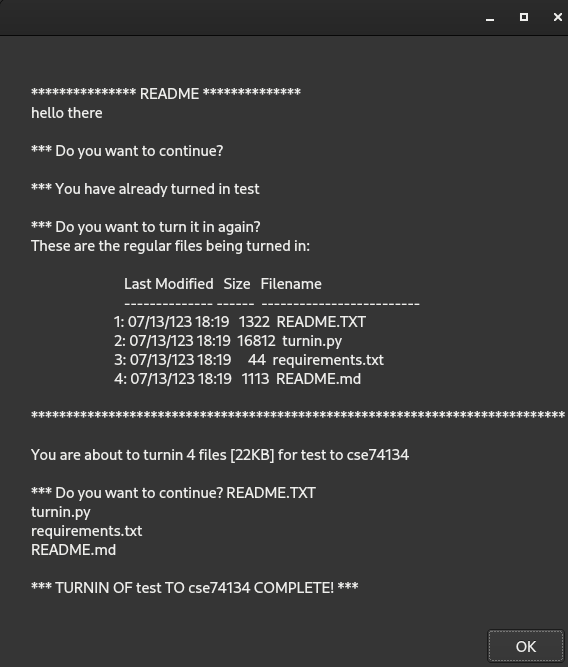

# TurnIn

> Please add a star to the repository if you find it usefull.

This is a program designed to be used with the turn in system at the [University of Ioannina](https://www.uoi.gr/).

## Use the app

### Through the releases

#### windows

There is a release available for windows download available as an exe file [here](https://github.com/porfanid/TurnIn/releases/download/2.0.0/TurninApp.exe).

All you have to do is download and run this file.

#### Linux
There is a release available for linux download available as an AppImage [here](https://github.com/porfanid/TurnIn/releases/download/2.0.0/turnin-client.AppImage).

Steps to use:
1. Download the package from the link.
1. Right click on the file and go to properties



3. Enable the `Execute as a programm` option. After that, you have to double click on the programm and the app will start.

More Info can be found [here](https://docs.appimage.org/introduction/quickstart.html)

### Through source code

To use the app you need to have python installed on your system.

After you have done this, you are going to have to install the dependencies. Yu can do this by going to the project using a terminal and the command cd and entering the following command:
```bash
pip install -r requirements.txt
```
This will take some time, as it needs to check the dependencies for the GUI and make sure that everything has been installed successfully


To install the App, open a command line interface, go to the location where you saved the folder, and run one of these commands 
based on the OS you have installed on your Computer:

On Windows:
```bash
py installer.py
```
On Linux:
```bash
python3 installer.py
```

Follow the Instructions of the Installer, and then you can run the executable `.exe` file whenever you want to complete a turnin.
Please refer to the screenshots for a more detailed preview.

## Test turnin

You can test the turnin app by using the assignment: `test@cse74134`.

> Please remember that in this particular assignment you cannot turn in binary files. See the notes [George Zachos](https://gzachos.com/) made for the [TurnIn](https://www.cse.uoi.gr/~gzachos/turnin/students.html)


## Screenshots

1. First you are presented with the login screen
1. You enter the credentials that you use in the computer lab(ΠΕΠ 1, ΠΕΠ 2, ΠΕΛΣ)
1. You select the files you want to upload(You are to select all the files you want to turnin in this step)
1. You are presented with a box to enter the assignement
1. You write the assignment code
1. You are presented with the output of the turnin command
