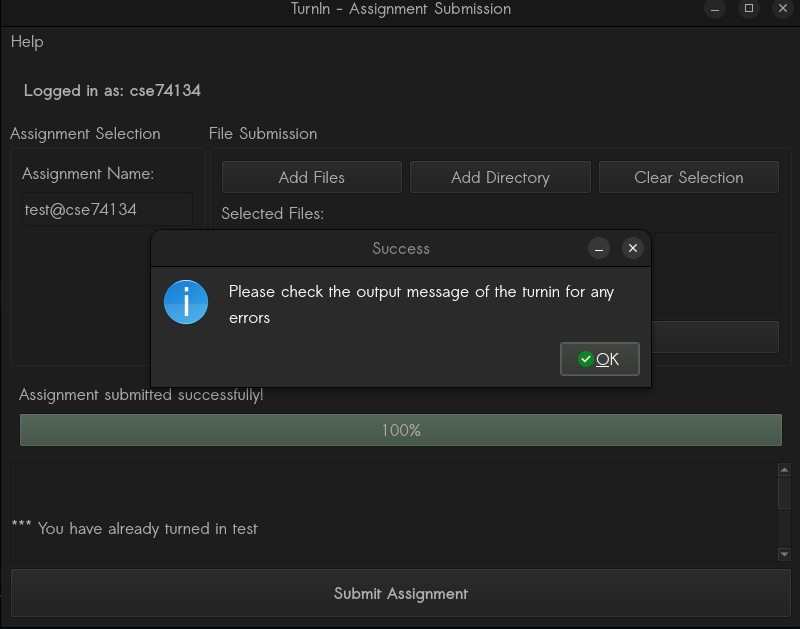
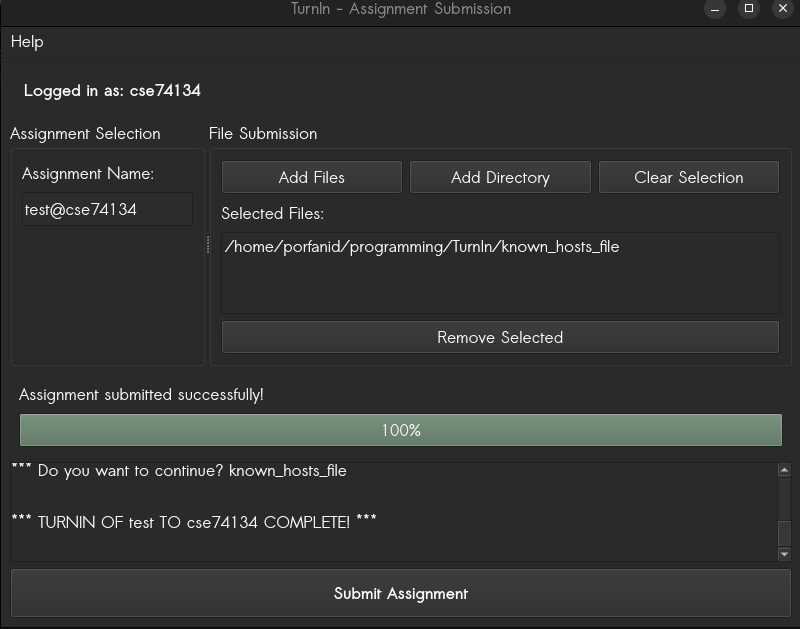

# Result

After that, you will be presented with a prompt telling you to check the result of the turnin.

If the result looks something like this:

The turn in is successful. Any other text, or no text at all means that something went wrong. Pease keep in mind that the name and number of files will not be the same as you will be turning in different files. If that doesn't work, you can try to debug the application by using the terminal and [contact me](mailto:cs04134@uoi.gr) or just follow the steps as they are described at the website of [George Zachos](https://www.cse.uoi.gr/~gzachos/turnin/students.html)