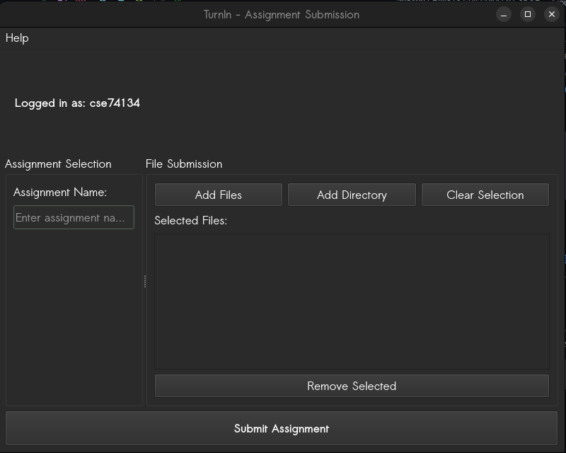
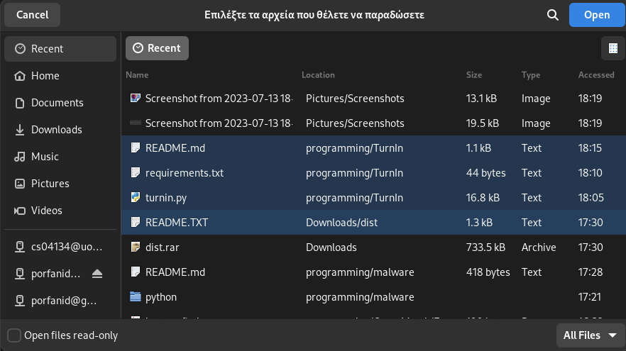
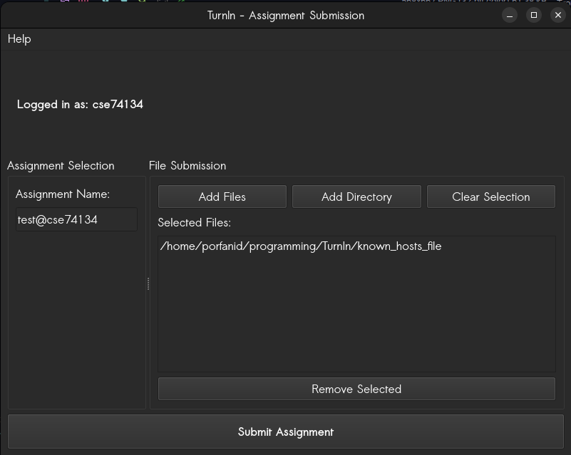
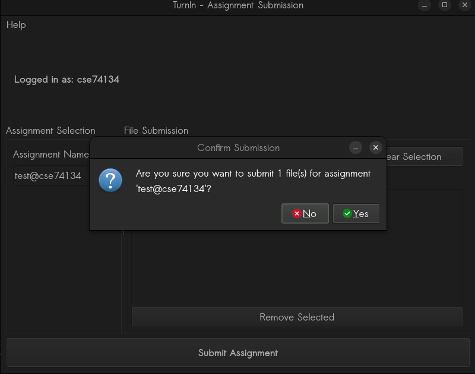

# Enter the assignment details

## Assignment Selection Tab

The TurnIn application now has a dedicated "Assignment Selection" tab where you enter your assignment code.

Enter the assignment code provided by your professor in the "Assignment Name:" field on the left side of the interface.

If you want to test the app, you can use the test assignment: `test@cse74134`

## Select Files

The TurnIn application interface has been significantly updated. Based on the screenshots provided, here's how to select and submit files:

### File Submission Interface

The application now has a two-tab interface with "Assignment Selection" and "File Submission" tabs at the top of the window.

In the File Submission tab, you have the following options:

1. **Add Files** - Click this button to select individual files
2. **Add Directory** - Click this button to select an entire directory of files
3. **Clear Selection** - Click this button to remove all currently selected files

### Selecting Files

When you click "Add Files" or "Add Directory", a file dialog will open. Selected files will appear in the "Selected Files:" box below the buttons, showing their full file path (e.g., `/home/porfanid/programming/TurnIn/known_hosts_file`).

If you need to remove a specific file from your selection, click on it in the list and then click the "Remove Selected" button at the bottom of the files list.

> Note: No binary files or files larger than 10mb are allowed

## Submission Process

After entering the assignment code and selecting your files in the File Submission tab, click the "Submit Assignment" button at the bottom of the window.

The application window must look something like this:

You will see a confirmation prompt asking if you're sure you want to submit the selected file(s) for your specified assignment:

The prompt will show the number of files being submitted and the assignment code. Click "Yes" to proceed with the submission or "No" to cancel.
